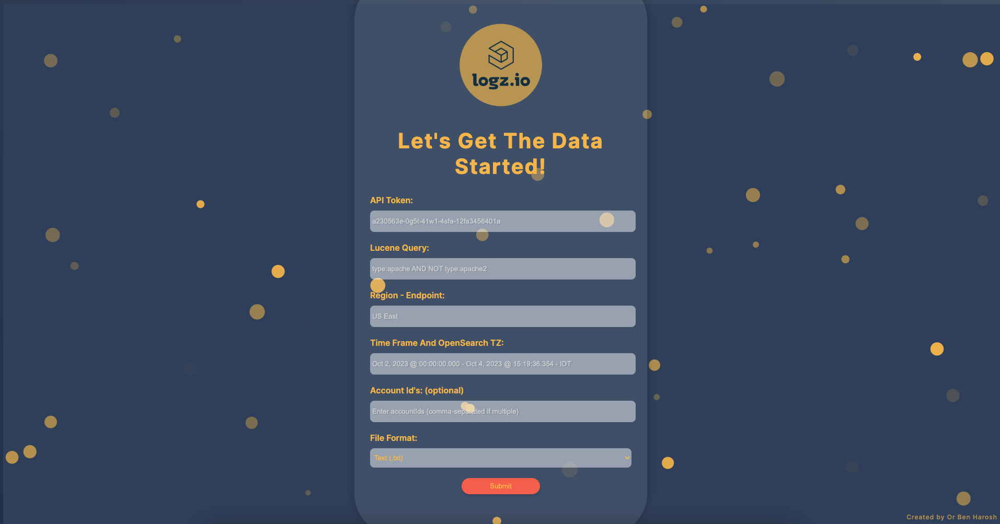

# Logz.io API Query Tool 🚀

Effortlessly query the Logz.io API through an intuitive Flask-based web interface. Whether you're an end-user or a developer looking to integrate with Logz.io, this tool simplifies the process and provides powerful data interpretation capabilities and overcomes some of the knone Log.io Log API limitions.



## 🌟 Features:

- 🖥️ **Web Interface**: A user-friendly interface for querying Logz.io Log data via API.
- 📊 **Data Interpretation**: The script `data_processor.py` interprets the insterted data to Logz.io API in a valid format.
- 📦 **Docker Integration**: Easily deployable using 2 Docker commands.

## ⚡ Quick Start:

1. 📥 Pull the Docker image:
   ```bash
   docker pull orbenharoshprojects/logzio-api-app
   ```

2. 🚀 Launch the Docker container:
   ```bash
   docker run -p 8000:8000 orbenharoshprojects/logzio-api-app
   ```

3. 🌐 Visit the app: [http://localhost:8000](http://localhost:8000)

## 🛠 How It Works:

- **Flask Interface**: The tool leverages Flask to provide a web interface. Users input their queries and the tool communicates with the Logz.io API.
  
- **Data Processing**: Upon fetching data from Logz.io, the `data_processor.py` script is used to interpret and, if necessary, transform the data before presenting it to the user.

## 🔍 Use Case Scenarios:

1. **Log Analysis**: Users can query specific logs from Logz.io and utilize the built-in data processing capabilities to understand trends, anomalies, or specific incidents.

2. **Integration with Other Systems**: Developers can use this tool as a mediator to fetch data from Logz.io and then integrate it into other systems or dashboards.

3. **Quick Debugging**: Without setting up a local development environment, users can quickly debug or check logs from Logz.io.

## 📚 Limitations & Considerations:

- **Rate Limiting**: The tool is subject to any rate limits imposed by the Logz.io API. Ensure not to exceed the permitted number of queries in a short time.

- **Data Volume**: The tool is designed for querying and not for massive data exports. For large data, consider using Logz.io's export functionality.

- **Security**: Always ensure that API keys and other sensitive information are securely handled. Avoid exposing such details in client-facing interfaces.

## 💡 Debugging:

- **Container Logs**: Check the Docker container logs to see if there are any issues or errors with the Flask server.
  ```bash
  docker logs [container_id]
  ```

- **API Responses**: The `data_processor.py` script processes API responses. If there are unexpected results, consider examining the raw API responses for clarity.

- **Network Issues**: Ensure that the Docker container has appropriate network permissions and that there aren't any firewalls or network configurations blocking the connection to Logz.io.

## 🤝 Connect & Contribute:

Feedback and contributions are the backbone of open-source. For issues, suggestions, or contributions, delve into our [GitHub repository](URL_TO_GITHUB_REPO). Let's grow together!
