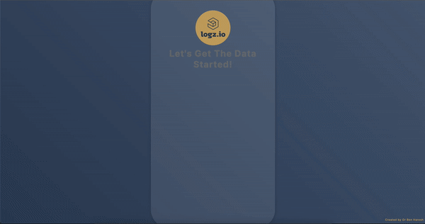
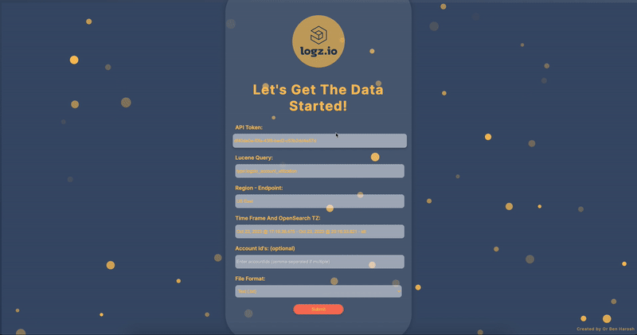
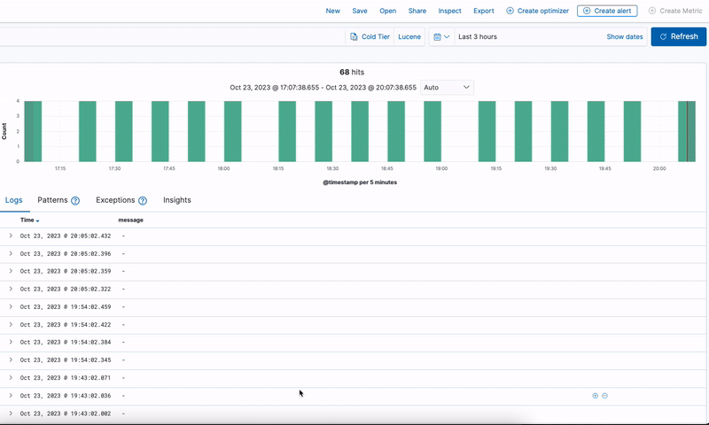

Your README is already well-structured. I've made a few refinements to improve readability and clarity. Here's the improved version:

---

# Logz.io API Query Tool 🚀
[](https://flask.palletsprojects.com/)
[](https://opensource.org/licenses/MIT)

Dive into our Flask interface, purposefully built to simplify your querying and data retrieval journey with Logz.io.

> **🚫 Disclaimer**: This is a community-driven tool and is NOT officially associated with or endorsed by Logz.io.

<div align="center">



</div>

## 📌 Features

- **Web-Based Queries**: Seamlessly input your Logz.io queries and fetch log data through an intuitive web interface.
  
- **Data Export**: Export data in your choice of CSV or TXT formats.

---

## 🔧 Data Expectations & Limitations

- **Query Format**: Our interface is tailored to accept the specific query format that the Logz.io API supports.

- **Data Parsing**: The `data_processor.py` script is structured with predefined configurations tailored for standard Logz.io responses.

- **Network Access**: Ensure your app can freely communicate with Logz.io. Ensure no restrictive firewalls or proxies are in place.

- **Community Reminder**: This isn't an official product of Logz.io, but a project from our community.

---

## 🚀 Getting Started

### macOS and Linux:

To set everything up, simply run the command below:

```bash
git clone https://github.com/orbenharoshprojects/Logz.io-API-Query-Tool "Logz.io-API-Query-Tool App" && cd "Logz.io-API-Query-Tool App" && chmod +x setup_and_run.sh && ./setup_and_run.sh
```

### 🖥️ Windows:

Just execute the command below:

```batch
git clone https://github.com/orbenharoshprojects/Logz.io-API-Query-Tool "Logz.io-API-Query-Tool App" && cd "Logz.io-API-Query-Tool App" && setup_and_run.bat
```

Post-setup, you can access the interface at [http://localhost:8000](http://localhost:8000).

<div align="center">



</div>

---

## 🧐 Finding & Setting Required Data

If you need to tweak data verification or patterns, adjustments can be made in `form.html` and `data_processor.py`.

The details below guide you on sourcing the needed information:

[Details on sourcing API Token, Lucene Query, etc.]

<div align="center">



</div>

> Additional options are described in the `data_processor.py` file. Remember, the default timezone in your Logz.io OpenSearch is set to your browser's timezone. If needed, contact the Logz.io Support team for modifications.

---

## 🐞 Debugging & Troubleshooting

- **Data Mismatches**: If the fetched data looks off, inspect the raw API responses. The `data_processor.py` script interprets the data in specific ways and can be modified.

- **UI Issues**: If the interface doesn't render correctly, ensure that all static assets are being served properly. The confidured pattrens can be modified in the `form.html` and the `data_processor.py` files. 

- **Connectivity Issues**: If you can't fetch data, ensure that the Docker container can reach Logz.io. Check network permissions and configurations.

---

## 🤲 Contribute

Found something amiss? Have an enhancement in mind? We're all ears. Be a part of our growing community and help us make this tool even better!

---
