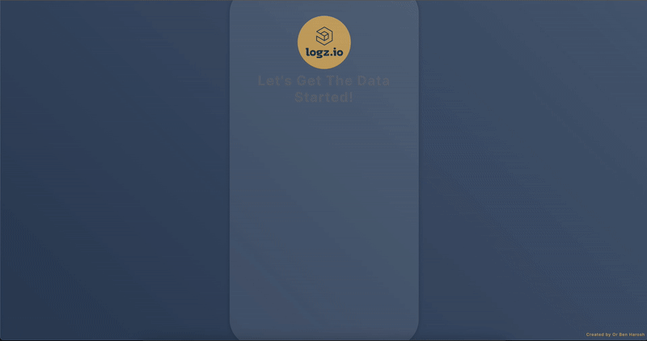

# Logz.io API Query Tool 🚀
[](https://flask.palletsprojects.com/)
[](https://www.docker.com/)
[](https://opensource.org/licenses/MIT)


Embark on an effortless journey with our Flask interface, designed to simplify querying and retrieving data from Logz.io.

> **🚫 Disclaimer**: This is a community project and is not officially supported or affiliated with Logz.io.

<div align="center">
  


</div>

## 📌 Features

- **Web-Based Queries**: Input your Logz.io queries via a user-friendly web interface.
  
- **Data Formats**: Save data in CSV or TXT, as per your preference.

---

## 🔧 Expected Data Format & Limitations

- **Query Format**: The interface expects queries in the specific format supported by the Logz.io API.

- **Data Limitations**: The `data_processor.py` script has certain hardcoded structures and limitations. It's designed to process standard Logz.io responses.

- **Rate Limits**: The tool does not bypass any API rate limits set by Logz.io.

- **Network Constraints**: The Docker container needs network access to Logz.io. Ensure there's no blocking firewall or proxy.

- **Not Official**: Remember, this tool is a community project and isn't an official Logz.io product.

---

## 🚀 Getting Started

1. Pull the Docker image:
   ```bash
   docker pull orbenharoshprojects/logzio-api-app
   ```

2. Launch the Docker container:
   ```bash
   docker run -it -v "$(pwd)/Downloads:/app/Downloads" -p 8000:8000  orbenharoshprojects/logzio-api-app:latest
   ```

3. Navigate to [http://localhost:8000](http://localhost:8000) in your browser.

<div align="center">


</div>

---

## 🧐  How to Find the Required Data?
- **API Token**: Can be found in Logz.io under the "Settings" -> "Manage Tokens" page for the needed account. 

- **Lucene Query**: A valid format witout the usage of wiilecards. 
>The pattrens can be modified in the `form.html` and the `data_processor.py` files.

- **Region - Endpoint**: The Can be found in Logz.io under the "Settings" page. 
>Supported options are listed in the `data_processor.py` file.

-**Time Frame And OpenSearch TZ**: The "start" and "end" time frame for the used query. Can be taken directly via Logz.io OpenSearch UI with the addition of the OpenSearch UI timezone.

<div align="center">


</div>

>Supported options are listed in the `data_processor.py` file and your Logz.io OS timezone is by defualt your webbroswer timezone. Buut, that can be modified by Logz.io Supports team if it was request to be changed.

- **Account Id's (optional)**: ID of the sub account to search. Can be found in Logz.io under the "Settings" page and used in a comma separated format.

- **File Format**: Currently supportes `.cvs` or `.txt` option. Defulat is `.txt` 

---

## 🐞 Debugging & Troubleshooting

- **Data Mismatches**: If the fetched data looks off, inspect the raw API responses. The `data_processor.py` script interprets the data in specific ways and can be modified.

- **UI Issues**: If the interface doesn't render correctly, ensure that all static assets are being served properly. The confidured pattrens can be modified in the `form.html` and the `data_processor.py` files. 

- **Connectivity Issues**: If you can't fetch data, ensure that the Docker container can reach Logz.io. Check network permissions and configurations.


## 🤲 Contribute

🔍 Found a bug? 🌟 Have a feature request? We welcome feedback and contributions. Join the community, and let's refine this tool together!
